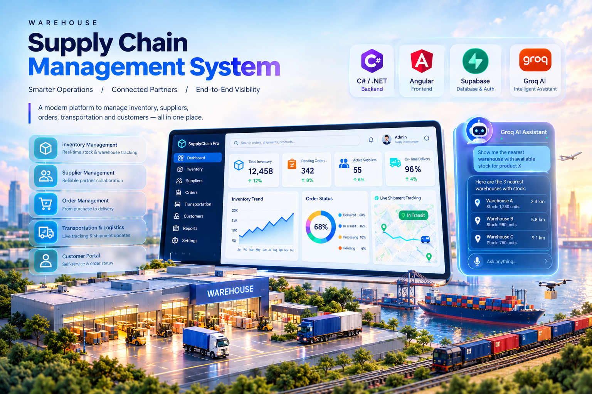

# Agri-Chain OS

An agentic farm-to-market supply chain platform. Track crop plots from planting to harvest, manage warehouse inventory, dispatch and monitor shipments on a live map, collect payments via UPI QR codes, get real commodity price forecasts, and let an AI agent operate the whole thing on your behalf — including two genuinely computed AI features: a **harvest-to-market routing optimizer** (price vs. distance vs. spoilage risk, not a lookup) and **crop quality grading from photos** (a real vision-model call).

Built as a C# backend and an Angular frontend, with Supabase used strictly as the Postgres database (auth is handled in-house by ASP.NET Core Identity, not Supabase Auth).

## Contents

[Features](#features) · [Architecture](#architecture) · [Tech stack](#tech-stack) · [Project structure](#project-structure) · [Frontend pages](#frontend-pages) · [Requirements](#requirements) · [Setup](#setup-first-time-only) · [Running the app](#running-the-app) · [Environment variables](#environment-variables) · [Database schema](#database-schema) · [API reference](#api-reference) · [The AI agent](#the-ai-agent) · [Seed data](#seed-data) · [Demo login](#demo-login) · [Troubleshooting](#troubleshooting) · [Known limitations](#known-limitations)

## Features

- **AI Agent** — conversational agent (Groq, tool-calling) covering forecasting, farm/inventory, logistics, finance, route optimization, and crop grading, chaining multiple actions from one instruction
- **Route Optimizer** — ranks candidate markets for a harvest by real net-expected-value scoring (price × quantity, minus transport cost, minus spoilage loss over transit time) — not just "highest price"
- **Crop Grading** — upload a produce photo, a vision model returns a grade (A/B/C), defects, and confidence
- **Forecast** — AI-generated 3-part price forecast (outlook, market-risk, strategic opportunities)
- **Market Analysis** — instant, non-AI: best market for a commodity, or best commodity for a market
- **Farm Management** — log plantings, track growing plots, harvest into inventory
- **Inventory** — live warehouse stock per commodity
- **Logistics** — dispatch shipments, live map (Leaflet) with simulated GPS progress
- **Finance & Sales** — UPI QR payment generation, sale logging, revenue dashboard
- **MCP server** — the agent's tools are also exposed over MCP (`/mcp`, HTTP/SSE), so Claude Desktop, Cursor, or any MCP client can operate the app directly

## Architecture

```
Angular (4200) ──REST + Bearer JWT──▶ ASP.NET Core (5000) ──EF Core──▶ Supabase Postgres
                                             │
                                             └── Groq API (chat + vision)
                                             └── MCP server (/mcp)
```

- Auth is entirely in-house (ASP.NET Core Identity issues/validates its own JWTs) — Supabase is only a Postgres database, accessed via its connection pooler, not used for auth.
- The AI agent, route optimizer, crop grading, and manual dashboard pages all share the same `AgriChain.Infrastructure/Services` layer (agent actions stay consistent with the UI), and that same tool set is also exposed as an MCP server for external clients.

## Tech stack

**Backend**: ASP.NET Core 8/10 Minimal APIs (C#), EF Core + Npgsql (Supabase Postgres), ASP.NET Core Identity + JWT, Groq SDK-equivalent HTTP client (chat + vision), `ModelContextProtocol`/`ModelContextProtocol.AspNetCore` (MCP server)
**Frontend**: Angular 18 (standalone components), Angular Material + Tailwind, `ng2-charts`/Chart.js, Leaflet, `qrcode`
**Data**: Supabase Postgres project `agri-chain-os`, ~5,000 seeded rows

## Project structure

```
supply-chain/
├── src/
│   ├── AgriChain.Domain/          # entities (FarmPlot, InventoryItem, Shipment, Sale, MarketPrice, Forecast, AppUser, CropGrading)
│   ├── AgriChain.Infrastructure/   # EF Core DbContext (mapped onto the existing tables), Services/*
│   ├── AgriChain.Agent/             # GroqClient, AgentOrchestrator, RoutingOptimizer, CropGradingService, MCP tools
│   └── AgriChain.Api/                # Program.cs, Endpoints/* (Auth, Market, Farm, Inventory, Logistics, Finance, Forecast, Agent, Grading)
├── frontend-ng/
│   └── src/app/
│       ├── core/                       # auth service (JWT + signals), http interceptor, route guard
│       ├── features/                    # login, dashboard, agent, forecast, market, farm, inventory, logistics, finance, grading
│       └── shared/                       # sidebar/topbar layout, shared components
├── scripts/seed_market_data.sql        # full ~17k-row price dataset + INSERT policy
├── agriculture.csv
└── README.md
```

## Frontend pages

| Route | Page |
|---|---|
| `/login` | Sign in / sign up |
| `/dashboard` | KPIs, revenue trend, inventory value, live shipment mini-map, harvest readiness, price volatility, route-optimizer insight |
| `/agent` | AI agent chat workspace, with a visible tool-call trail |
| `/forecast` | AI 3-part price forecast |
| `/market` | Non-AI market analysis (best market / best commodity) |
| `/farm` | Plantings, harvest-into-inventory |
| `/inventory` | Warehouse stock table |
| `/logistics` | Route optimizer, dispatch form, per-shipment expandable tracking cards |
| `/finance` | UPI QR generation, sale logging, revenue dashboard |
| `/grading` | Crop photo upload → AI grade/defects/confidence |

## Requirements

| Tool | Version | Notes |
|---|---|---|
| [.NET SDK](https://dotnet.microsoft.com/download) | 8.0+ (developed/tested on 10.0.400) | for the backend (`src/`) |
| [Node.js](https://nodejs.org/) | 18+ (tested on 22.x) | for the frontend (`frontend-ng/`) |
| npm | ships with Node | Angular CLI itself runs via `npx`, no global install needed |
| A Supabase project | — | Postgres only, accessed via the connection pooler (see [Environment variables](#environment-variables)) |
| A [Groq](https://console.groq.com/) API key | free tier works | powers `/agent/chat` and `/grading/analyze`; optional — the app runs without it, those two features just report "not configured" |

Everything else is a project dependency restored automatically by `dotnet build` / `npm install`.

## Setup (first time only)

```powershell
# Backend — restore packages, wire up secrets
cd src
copy AgriChain.Api\appsettings.Development.json.example AgriChain.Api\appsettings.Development.json
# then edit that file: fill in the real Supabase DB password and GROQ_API_KEY (see below)
dotnet restore
dotnet build

# Frontend — install npm packages
cd ..\frontend-ng
npm install
```

To change the database schema later: `dotnet tool install --global dotnet-ef`, then `dotnet-ef database update --project AgriChain.Infrastructure --startup-project AgriChain.Api` from `src/`.

## Running the app

Two terminals, every time you want to run the app. **Run the backend command from the repo root** (`supply-chain\`), not from inside `src\AgriChain.Api\` — `dotnet run --project` resolves the path itself.

```powershell
# Terminal 1 — backend (repo root) — wait for "Now listening on: http://localhost:5000"
dotnet run --project src\AgriChain.Api
```

```powershell
# Terminal 2 — frontend — wait for "Local: http://localhost:4200/"
cd frontend-ng
npx ng serve
```

Then open **http://localhost:4200** and sign up, or use the [demo login](#demo-login).

## Environment variables

All in `src/AgriChain.Api/appsettings.Development.json` (gitignored — copy from `appsettings.Development.json.example` and fill in real values, never commit real secrets to the `.example` file):

| Key | Purpose |
|---|---|
| `ConnectionStrings:DefaultConnection` | Supabase Postgres connection string, via the **connection pooler** (the direct `db.<ref>.supabase.co` host is IPv6-only and often unreachable) — format: `Host=aws-0-<region>.pooler.supabase.com;Port=5432;Database=postgres;Username=postgres.<project-ref>;Password=<db-password>;SSL Mode=Require` |
| `Jwt:Secret` / `Jwt:Issuer` | Token signing — replace the dev secret before any real deployment |
| `Groq:ApiKey` | Enables `/agent/chat` and `/grading/analyze`; without it both return a clean "not configured" message |

`frontend-ng/src/environments/environment.ts` / `environment.development.ts` hold `apiBaseUrl` (`http://localhost:5000` by default).

## Database schema

| Table | Purpose |
|---|---|
| `market_prices` | commodity/state/market price data |
| `forecasts` | saved AI-forecast & market-analysis history (`user_id` → `AspNetUsers.Id`) |
| `farm_plots` | plantings (`GROWING`/`HARVESTED`) |
| `inventory` | warehouse stock per commodity |
| `shipments` | dispatched loads (`IN_TRANSIT`/`ARRIVED`/`SOLD`) with simulated lat/lon |
| `sales` | logged sales & revenue |
| `crop_gradings` | vision-model grading results per photo |
| `AspNetUsers` + Identity tables | in-house auth (replaces Supabase Auth) |

Shipment destinations are MD5-hashed into stable India coordinates (no live GPS feed). Migrations are hand-reviewed brownfield migrations that only add new tables and repair `forecasts.user_id`'s FK — the pre-existing 5 tables' data is untouched.

## API reference

All routes except `/health` and `/auth/*` require `Authorization: Bearer <jwt>`.

`GET /health` · `POST /auth/register` · `POST /auth/login` · `GET /market/commodities` · `GET /market/markets` · `POST /market/forecast` · `POST /market/analyze` · `GET /forecasts` · `GET|POST /farm/plots` · `POST /farm/harvest` · `GET /inventory` · `GET|POST /logistics/shipments` · `POST /logistics/shipments/advance` · `POST /logistics/shipments/{id}/deliver` · `POST /logistics/optimize-route` · `GET|POST /finance/sales` · `GET /finance/summary` · `POST /agent/chat` · `POST /grading/analyze`

Swagger UI is available at `/swagger` in development.

## The AI agent

`POST /agent/chat` runs a Groq tool-calling loop over: `get_price_forecast`, `find_best_market`, `find_best_commodity`, `get_farm_plots`, `add_farm_plot`, `harvest_plot`, `get_inventory`, `create_shipment`, `get_active_shipments`, `log_sale`, `get_financial_summary`, `optimize_shipment_route`, `grade_crop_photo` — each backed by the same service functions the manual pages use. The same tools are exposed over MCP at `/mcp` for external MCP clients.

## Seed data

~5,000 rows pre-loaded in Supabase: ~4,150 `market_prices` (40 commodities × 15 states), 150 `farm_plots` (104 growing / 46 harvested), 14 `inventory` rows, 300 `shipments` (240 in transit / 10 arrived / 50 sold), 350 `sales`, 60 `forecasts`. Run `scripts/seed_market_data.sql` for the full ~17k-row dataset instead.

## Demo login

```
Email:    demo@agrichain.app
Password: Demo!2026Pass
```

Auto-seeded into `AspNetUsers` on backend startup — no email confirmation step, works out of the box.

## Troubleshooting

- **`ModuleNotFoundError`-style path issues / `dotnet run` fails to find the project** — run from the repo root: `dotnet run --project src\AgriChain.Api`, not from inside `src\AgriChain.Api\`.
- **EF Core migration fails with a DNS error on `db.<ref>.supabase.co`** — that host is IPv6-only; use the pooler host (`aws-0-<region>.pooler.supabase.com`) instead, with username `postgres.<project-ref>`.
- **`28P01: password authentication failed`** — the password in `appsettings.Development.json` doesn't match Supabase's current database password. Reset it from the dashboard (Project Settings → Database → **Reset database password** — use the button, don't type a custom value from memory) and copy the generated value exactly.
- **Agent/grading replies "not configured" or with a provider error** — set `Groq:ApiKey` in `appsettings.Development.json`. If Groq returns `model_permission_blocked_org`, the models this app uses are blocked in your Groq organization's settings — enable them at console.groq.com/settings/limits, or swap the model constants in `src/AgriChain.Agent/GroqClient.cs` for ones your org has access to.
- **`dotnet build` fails with `MSB3027`/`MSB3021: ... being used by another process`** — a previous `dotnet run` is still holding the output DLLs. Stop that backend process, then rebuild.
- **Agent chat throws `Groq API error 429` mid-conversation** — a free-tier rate limit (input/output tokens per minute), not a bug; wait a few seconds and retry. Multi-tool-call conversations use more tokens per turn.

## Known limitations

- Logistics is simulated — destination coordinates are deterministically hashed from the market name (no real geocoding), and shipment progress is computed from real elapsed time vs. an estimated transit duration (distance ÷ assumed truck speed), not an actual GPS feed.
- UPI QR codes are a `upi://pay?...` deep link only — no real payment gateway.
- The routing optimizer's spoilage-risk table is a static commodity-keyword lookup, not a live perishability model.
- The Groq free tier enforces fairly low per-minute token limits; heavy back-to-back agent/grading use can hit `429` rate limits.

## Roadmap

- Real geocoding for shipment destinations instead of the deterministic hash.
- A live perishability model (or a small ML lookup) instead of the static spoilage-rate table.
- Real UPI/payment gateway integration in place of the deep-link-only QR flow.
- Push notifications (e.g. via the MCP server or a webhook) when a shipment arrives.

## Data & license

`agriculture.csv` is a public Indian commodity mandi price dataset (state/market/commodity/min-max-modal price), used here for seeding demo data only. This project itself has no license file yet — treat it as all-rights-reserved by default unless the repo owner adds one.
