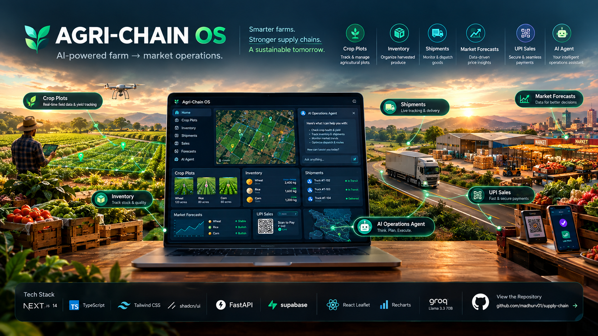

# Agri-Chain OS

An agentic farm-to-market supply chain platform. Track crop plots from planting to harvest, manage warehouse inventory, dispatch and monitor shipments on a live map, collect payments via UPI QR codes, and run commodity price forecasts — either through dedicated dashboard pages or by asking the built-in **AI operations agent** to do it in plain language ("harvest plot A and ship 200kg of wheat to Pune").

Rebuilt from an earlier Streamlit prototype into a two-service web app: a FastAPI backend and a Next.js frontend, backed by a dedicated Supabase Postgres project.

## Features

- **AI Agent** — conversational agent (Groq, tool-calling) that forecasts prices, manages farm plots/inventory, dispatches shipments, logs sales, and summarizes finances, chaining multiple actions from one instruction
- **Forecast** — AI-generated 3-part price forecast (price outlook, market-risk, strategic opportunities)
- **Market Analysis** — instant, non-AI: best market for a commodity, or best commodity for a market
- **Farm Management** — log plantings, track growing plots, harvest into inventory
- **Inventory** — live warehouse stock per commodity
- **Logistics** — dispatch shipments, live map (react-leaflet) with simulated GPS progress
- **Finance & Sales** — UPI QR payment generation, sale logging, revenue dashboard

## Architecture

```
Next.js (3000) ──REST + Bearer JWT──▶ FastAPI (8000) ──▶ Supabase Postgres
      │                                     │                    ▲
      └── Supabase JS (auth only) ──────────┘                    │
                                             └── tool calls ──▶ Groq API
```

- The frontend only uses Supabase for auth (sign up/in, session). All data goes through the backend.
- The backend holds no privileged DB credentials — every request forwards the caller's own Supabase JWT, so Postgres Row Level Security is the real authorization boundary.
- The AI agent and the manual dashboard pages share the same `backend/services/` layer, so agent actions stay consistent with the UI.

## Tech stack

**Backend**: FastAPI (Python 3.12), Supabase Python client, Groq SDK (`llama-3.3-70b-versatile`)
**Frontend**: Next.js 14 (App Router, TypeScript), Tailwind + shadcn/ui, `@supabase/supabase-js` (auth only), recharts, react-leaflet, react-hook-form + zod, qrcode.react
**Data**: dedicated Supabase Postgres project (`agri-chain-os`), RLS on every table, ~5,000 seeded rows

## Project structure

```
supply-chain/
├── backend/
│   ├── main.py, config.py, auth.py, supabase_client.py
│   ├── routers/     # agent, market, farm, inventory, logistics, finance, forecasts
│   ├── services/     # business logic — shared by routers and the agent's tools
│   └── agent/         # tools.py (schemas + dispatch), orchestrator.py (Groq loop)
├── frontend/
│   ├── app/login/, app/(dashboard)/  # agent, forecast, market, farm, inventory, logistics, finance
│   ├── components/                    # sidebar, topbar, stat cards, map, shadcn/ui kit
│   └── lib/api.ts, lib/supabase.ts
├── scripts/seed_market_data.sql       # full ~17k-row price dataset + INSERT policy
├── agriculture.csv
└── README.md
```

## Setup

**Prerequisites**: Python 3.12+, Node.js 18+, a Supabase project (already provisioned), a free [Groq](https://console.groq.com/) API key (optional, for the AI agent).

```powershell
# Backend
cd backend
python -m venv venv
venv\Scripts\activate
pip install -r requirements.txt
copy .env.example .env   # fill in SUPABASE_URL, SUPABASE_ANON_KEY, GROQ_API_KEY

# Frontend
cd ..\frontend
npm install
copy .env.local.example .env.local   # fill in NEXT_PUBLIC_* vars
```

## Running the app

Two terminals, both from the **repo root**:

```powershell
# Terminal 1 — backend (run from repo root, not from inside backend\)
backend\venv\Scripts\activate
uvicorn backend.main:app --reload --port 8000
```

```powershell
# Terminal 2 — frontend
cd frontend
npm run dev
```

Open **http://localhost:3000**, sign up (or use the [demo login](#demo-login)).

## Environment variables

| File | Variable | Purpose |
|---|---|---|
| `backend/.env` | `SUPABASE_URL`, `SUPABASE_ANON_KEY` | Supabase project + anon key (backend re-auths as the caller per request) |
| `backend/.env` | `GROQ_API_KEY` | Enables `/agent/chat`; without it the agent replies "not configured" |
| `frontend/.env.local` | `NEXT_PUBLIC_SUPABASE_URL/ANON_KEY` | Client-side auth |
| `frontend/.env.local` | `NEXT_PUBLIC_API_BASE_URL` | Backend URL (`http://localhost:8000` in dev) |
| `frontend/.env.local` | `NEXT_PUBLIC_UPI_ID` | Payee UPI ID for payment QR codes |

## Database schema

| Table | Purpose |
|---|---|
| `market_prices` | commodity/state/market price data |
| `forecasts` | saved AI-forecast & market-analysis history |
| `farm_plots` | plantings (`GROWING`/`HARVESTED`) |
| `inventory` | warehouse stock per commodity |
| `shipments` | dispatched loads (`IN_TRANSIT`/`ARRIVED`/`SOLD`) with simulated lat/lon |
| `sales` | logged sales & revenue |

All tables have RLS enabled; shipment destinations are MD5-hashed into stable India coordinates (no live GPS feed).

## API reference

All routes except `/health` require `Authorization: Bearer <supabase_access_token>`.

`GET /health` · `GET /market/commodities` · `GET /market/markets` · `POST /market/forecast` · `POST /market/analyze` · `GET /forecasts` · `GET|POST /farm/plots` · `POST /farm/harvest` · `GET /inventory` · `GET|POST /logistics/shipments` · `POST /logistics/shipments/advance` · `POST /logistics/shipments/{id}/deliver` · `GET|POST /finance/sales` · `GET /finance/summary` · `POST /agent/chat`

## The AI agent

`POST /agent/chat` runs a Groq tool-calling loop over: `get_price_forecast`, `find_best_market`, `find_best_commodity`, `get_farm_plots`, `add_farm_plot`, `harvest_plot`, `get_inventory`, `create_shipment`, `get_active_shipments`, `log_sale`, `get_financial_summary` — each backed by the same service functions the manual pages use, and chainable across one instruction.

## Seed data

~5,000 rows pre-loaded: ~4,150 `market_prices` (40 commodities × 15 states), 150 `farm_plots` (104 growing / 46 harvested), 14 `inventory` rows, 300 `shipments` (240 in transit / 10 arrived / 50 sold), 350 `sales`, 60 `forecasts`. Run `scripts/seed_market_data.sql` for the full ~17k-row dataset instead.

## Demo login

```
Email:    demo@agrichain.app
Password: Demo!2026Pass
```

Pre-confirmed, no email verification needed. You can also sign up your own account (Supabase emails a confirmation link).

## Troubleshooting

- **`ModuleNotFoundError: No module named 'backend'`** — run `uvicorn` from the repo root, not from inside `backend\`.
- **`[WinError 10013]` on startup** — port 8000 already in use; stop the other process or use a different `--port`.
- **Sign-up email rate-limited** — Supabase's default mailer caps at a few emails/hour. Use the demo login, wait it out, or disable "Confirm email" in Supabase Auth settings for local testing.
- **Agent replies "not configured"** — add `GROQ_API_KEY` to `backend/.env` and restart.

## Known limitations

- Logistics is simulated (hashed coordinates + a progress counter), not real GPS.
- Missing-auth requests return `422` rather than `401` (still correctly rejected).
- UPI QR codes are a `upi://pay?...` deep link only — no real payment gateway.
